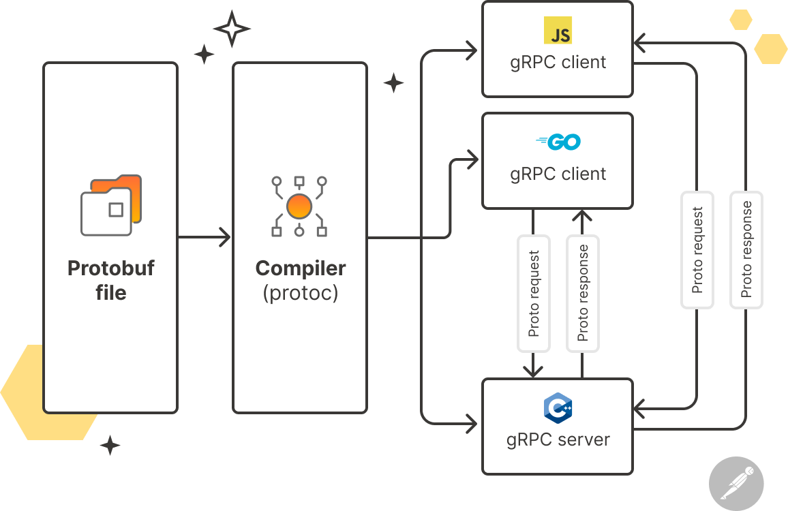

+++
title = "gRPC-Go 使用指南"
description = '本文简述了 gRPC 的基本概念及 gRPC-Go 环境的搭建方法，并提供了 gRPC-Go 的示例程序，包括服务端与客户端的编写及测试步骤。'
date = 2021-10-04
[taxonomies]
tags= ["gRPC", "Golang"]
+++

## 1、gRPC 框架原理



RPC 框架通过隐藏底层的数据传输方式（TCP/UDP）、序列化方式（XML/JSON/二进制）和通信细节，<font color=red>使服务调用变得简单透明</font>。用户只需提供 IP 和端口，就能像调用本地接口一样方便地访问远程服务。使用体验显示，相比传统 HTTP 服务，这种方式更为便捷。而 gRPC 是一个高性能、开源的通用 RPC 框架，专为服务端和移动端设计，基于 HTTP/2。gRPC 特点如下：

- 语言中立，支持多种语言；
- 基于 IDL 文件定义服务，通过 proto3 工具生成指定语言的数据结构、服务端接口以及客户端 Stub；
- 通信协议基于标准的 HTTP/2 设计，支持双向流、消息头压缩、单 TCP 的多路复用、服务端推送等特性，这些特性使得 gRPC 在移动端设备上更加省电和节省网络流量；
- 序列化支持 PB（Protocol Buffer）和 JSON，PB 是一种语言无关的高性能序列化框架，基于 HTTP/2 + PB, 保障了 RPC 调用的高性能。

## 2、依赖安装

- 安装 golang

```bash
wget https://golang.org/dl/go1.17.linux-amd64.tar.gz
sha256sum go1.17.linux-amd64.tar.gz
tar -C /usr/local -xzf go1.17.linux-amd64.tar.gz
# 修改环境变量, 即在~/.bashrc文件末尾添加如下语句即可：
export PATH=$PATH:/usr/local/go/bin
export GO111MODULE=on
export GOPROXY=https://mirrors.tencent.com/go/,goproxy.cn,direct
export GOSUMDB=off
```

- 安装 protoc(>=3.0)

直接在 GitHub Release 下载对应平台[最新版本的二进制文件](https://github.com/protocolbuffers/protobuf/releases/latest)，下载完成后解压到指定目录，然后将 bin 目录添加到环境变量即可。

- 安装 gprc protocol 插件

```bash
go install google.golang.org/protobuf/cmd/protoc-gen-go@v1.26
go install google.golang.org/grpc/cmd/protoc-gen-go-grpc@v1.1
```

- 配置环境变量

```bash
echo 'export PATH=$PATH:$GOPATH/bin' >> ~/.bashrc
```

## 3、gRPC 服务示例程序

- 编写 pb 文件 helloworld.proto

```protobuf
syntax = "proto3";

option go_package = "github.com/botao/helloworld";

package helloworld;

// The greeting service definition.
service Greeter {
  // Sends a greeting
  rpc SayHello (HelloRequest) returns (HelloReply) {}

  rpc SayHelloAgain (HelloRequest) returns (HelloReply) {}
}

// The request message containing the user's name.
message HelloRequest {
  string name = 1;
}

// The response message containing the greetings
message HelloReply {
  string message = 1;
}
```

- 编写自动生成框架代码脚本

```bash
#!/bin/bash
cd $(dirname $0) || exit 1
mkdir -p v1

protoc --go_out ./v1 --go_opt paths=source_relative \
       --go-grpc_out ./v1 --go-grpc_opt paths=source_relative helloworld.proto

# 当要使用grpc-gateway特性时可采取下列模版生成代码
# 替换成对应的目录，对应内容：https://github.com/googleapis/googleapis，https://github.com/protocolbuffers/protobuf
# PB_INCLUDE="-I/root/go/src/github.com/googleapis/ -I/root/go/src/github.com/protocolbuffers/protobuf/src"

# protoc -I . $PB_INCLUDE \
#     --go_out ./v1 --go_opt paths=source_relative \
#     --go-grpc_out ./v1 --go-grpc_opt paths=source_relative helloworld.proto

# 当要使用grpc-gateway特性时使用
# protoc -I . $PB_INCLUDE \
#     --grpc-gateway_out ./v1 \
#     --grpc-gateway_opt logtostderr=true \
#     --grpc-gateway_opt paths=source_relative \
#     --grpc-gateway_opt generate_unbound_methods=true helloworld.proto
```

- 编写服务端代码

```go
package main

import (
	"context"
	"log"
	"net"

	pb "github.com/botao/helloworld/proto/v1"
	"google.golang.org/grpc"
)

const (
	port = ":50051"
)

// server is used to implement helloworld.GreeterServer.
type server struct {
	pb.UnimplementedGreeterServer
}

// SayHello implements helloworld.GreeterServer
func (s *server) SayHello(ctx context.Context, in *pb.HelloRequest) (*pb.HelloReply, error) {
	log.Printf("Received: %v", in.GetName())
	return &pb.HelloReply{Message: "Hello " + in.GetName()}, nil
}

func (s *server) SayHelloAgain(ctx context.Context, in *pb.HelloRequest) (*pb.HelloReply, error) {
	log.Printf("Received: %v", in.GetName())
	return &pb.HelloReply{Message: "Hello again" + in.GetName()}, nil
}

func main() {
	lis, err := net.Listen("tcp", port)
	if err != nil {
		log.Fatalf("failed to listen: %v", err)
	}
	s := grpc.NewServer()
	pb.RegisterGreeterServer(s, &server{})
	log.Printf("server listening at %v", lis.Addr())
	if err := s.Serve(lis); err != nil {
		log.Fatalf("failed to serve: %v", err)
	}
}
```

- 编写客户端代码

```go
package main

import (
    "context"
    "log"
    "os"
    "time"

    "google.golang.org/grpc"
    pb "github.com/botao/helloworld/proto/v1"
)

const (
    address     = "localhost:50051"
    defaultName = "world"
)

func main() {
    // Set up a connection to the server.
    conn, err := grpc.Dial(address, grpc.WithInsecure(), grpc.WithBlock())
    if err != nil {
        log.Fatalf("did not connect: %v", err)
    }
    defer conn.Close()
    c := pb.NewGreeterClient(conn)

    // Contact the server and print out its response.
    name := defaultName
    if len(os.Args) > 1 {
        name = os.Args[1]
    }
    ctx, cancel := context.WithTimeout(context.Background(), time.Second)
    defer cancel()
    r, err := c.SayHello(ctx, &amp;pb.HelloRequest{Name: name})
    if err != nil {
        log.Fatalf("could not greet: %v", err)
    }
    log.Printf("Greeting: %s", r.GetMessage())

    r, err = c.SayHelloAgain(ctx, &amp;pb.HelloRequest{Name: name})
    if err != nil {
        log.Fatalf("could not greet: %v", err)
    }
    log.Printf("Greeting: %s", r.GetMessage())
}
```

- 执行测试
  
- 代码结构
  
