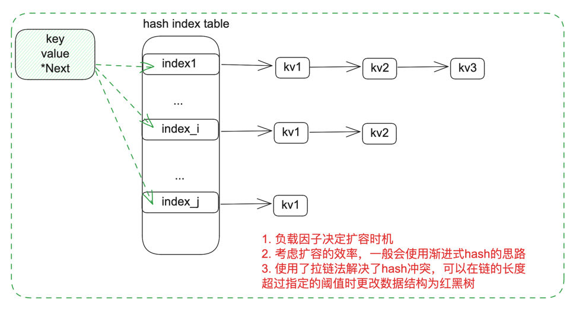
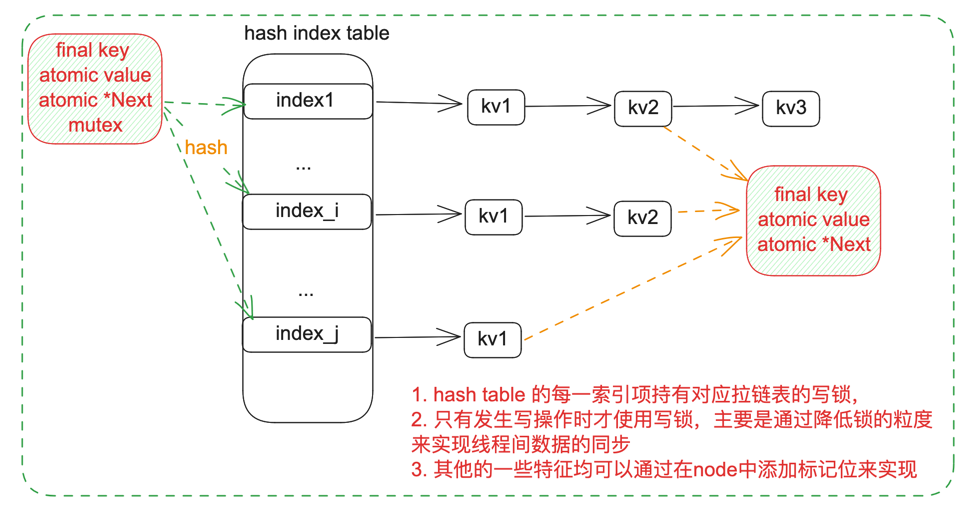
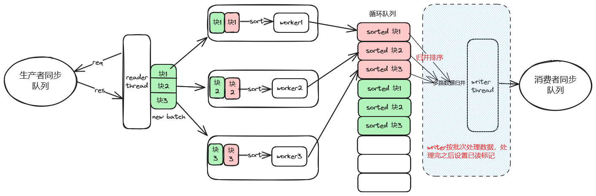

+++
title = "几个有意思的设计问题以及解决方案"
description = '在有的面试中总会给出一些简单的设计问题作为笔试题目让候选人解答，本文记录几个有意思的小问题：设计并发安全的 HashMap、设计高性能的内存队列、蓄水池采样算法的经典应用。'
date = 2024-10-04
[taxonomies]
tags= ["Interview", "Design"]
+++

## 1. 设计线程安全高性能的 HashMap

&#x2003;说实话从在接触这道面试题之前，我从未去思考或者了解过并发 HashMap 的实现原理，我可以脱口而出普通 HashMap 的底层实现原理，甚至可以说出 CPP STL 中两个 HashMap unordered_map 和 map 的区别以及优势和劣势，但是对于并发 HashMap 的实现原理，我一无所知。如果是面试中直接提问的话，以我不太聪明的样子，我应该能提出借助锁的方式来实现，但具体的实现方式在回答时，肯定是支支吾吾、顾左右而言他，在如今这个愈发内卷的求职市场，毫无疑问会被 Pass。

首先思考普通 HashMap 的实现原理，数据结构设计如下图所示：


我选择使用数据+链表的底层存储结构来实现 HashMap，数组用来快速定位和查找元素，链表用来解决哈希冲突的问题。同时为避免桶被多个 HashKey 映射到（即 hash 冲突很高），我们可以考虑在链表长度到达一定的阈值之后将其转化为红黑树，以提高查找效率。

接下来需要考虑如何设计线程安全的 HashMap, 如果仍旧使用上图所示的数据结构，在将其设计或者改造为线程安全的 HashMap  
时，有以下几个点需要重新考虑：

- 由于 HashMap 底层未使用锁，所以在同时访问同一个 key 时，会发生 Data Race 的情况
- 由于我们会使用链表来作为底层的数据存储结构，多线程的情况下，可能会出现链表被破坏的情况（同时插入+删除同一个链表）
- 直接使用 std::mutex 来保证数据线程安全，会导致性能下降

**改造为线程安全的 HashMap**

一种显而易见的设计思路就是为 hash 表中的每一个表项设置单独的读写锁，来通过将锁的粒度细化来提高并发度。但是这样的设计会导致即使 hash 冲突不是太严重的情况下，也会导致性能的下降，因为每个表项都设置了一个读写锁。

所以我们可以考虑引入 CAS 来降低获取锁的开销，在读取数据、获取最新的链表头节点以及插入新的链表头节点时直接使用 CAS  
来保证线程安全，避免使用锁。这样对于设计良好，hash 冲突不是太严重的情况下，会大大减少获取锁导致的线程上下文切换开销。最终并发安全的 HashMap 设计如下图所示：


为了实现的方便，我们直接使用 atomic 类来实现相关的 CAS 操作。以下是一些关键函数的关键逻辑实现，先定义链表项如下：

```cpp
template <typename T>
class Node {
    const std::string key_;
    std::atomic<T> value_;
    std::atomic<Node<T>*> next_;
    // std::mutex mutex_;
};
```

- put 操作

```cpp
// 1. 计算hash值，定位表项
// 2. 使用cas判断表项是否存在, 不存在的话直接构造链表插入到表头，此时不需要锁
// 3. 如果表项存在，需要加锁，然后遍历当前key是否存在，不存在插入到链表尾部，存在更新对应的值
// 4. 最后，如果关心 map的数量，可以累加计数器
```

- get 操作

```cpp
// 1. 计算hash值，定位表项
// 2. 直接遍历即可，因为使用了CAS，我们总是能保证读取到最新的链表节点数据，而不是脏数据。需要注意的是，使用时注意判空，因为在读取的过程中可能会有节点被删除
// 读操作不需要加锁
```

- remove 操作

```cpp
// 1. 计算hash值，定位表项
// 2. 找到对应的表项，先对表项对应的链表加锁，遍历找到节点之后，删除节点
```

- 扩容操作

```cpp
// 1. 申请当前 size 倍数大小的存储空间
// 2. 可以在有新的put/delete 操作时触发扩容操作，直到表项迁移完成
// 3. 如此，当触发扩容操作时，可以让多个线程同时对不同表项进行数据迁移，以提升效率
```

## 2. 设计一个基于内存的消息消费队列

题目的要求可以总结为以下几个点：

- CPU 计算资源尽可能少，内存可以认为无限，且输出数据的延迟尽可能低。要求我们要尽可能快的读取生产的数据，并使用高效的排序算法，及时将数据写入到下游同步队列中
- 限制输入队列中的位置序号和输出队列中的位置序号之差不超过 10 万。这说明我们每一个批次处理的数据最多为 10 万条
- 模块内部最多只能创建 10 个线程，说明系统的资源是有限的，我们需要合理的利用资源，最好让系统可配置化

结合以上这几点，我的设计思路如下：


图中的设计模型可以简单概括为，一个 reader thread 负责从生产者同步队列按批次读取数据，每个批次的数据（`m=10w`）分为多个块，块的数目由 worker 工作线程的数目（n）来决定，故每个块的大小应该 = `m/n`，之后在 worker 线程内部我们局部针对这个独立的块进行排序。最终每个 worker 将排序之后的数据存储到循环队列里面，循环队列设计为每 3 项存储一个批次的数据，每一项保证内部有序。  
此后，writer thread 使用大小为 n 的优先队列多路归并排序一个批次内所有的元素并且把他们一一发送到消费者同步队列供其他业务方使用。

值得注意的是我们在 worker 内部也设置了缓存队列，这意味着，reader 无须等待数据全部被排序处理就可以继续读取下一个批次的数据。后续引入循环队列的目的也是类似的思路，让 reader, worker, writer 三个主要的组件异步执行可以极大的扩展系统的性能。

以上应该可以应对大部分并发场景下的业务，下面是将 reader 线程改造为多线程读取模式的一点思考：）


假设现在每批次我们直接写入最大的 10 万条数据，那么我们可以将数据分为两个阶段来处理，我的主要实现思路如下：

1.**启动 n 个读取数据线程**，则每个线程每一个批次应该读取的数据是 `y=10w/n`，然后我们将该批次的 y 个数据存入一个独立的优先队列中（本质是用 weight 做排序的小根堆）

如图中所示，取 n=3，则 `y=3.3w≈420kb`，然后将这个队列的数据存储到如 p2 所示的优先队列数组里面，其中每一个读取数据线程存放数据的位置是有规律的，以第 0 个线程为例，每批次存放数据的位置是 `0, 3, 6, 9, 12, ...` ，第 1 个线程存放的位置是 `1, 4, 7, 10, 13, ...`，以此类推。需要注意的时如果当前批次的数据量不足 `y`，则直接将数据存入到优先队列中，不需要等待。

但考虑到线程调度的不确定性，势必要通过一些同步措施确保当前批次数据在 n 个数据读取线程中分布均匀，具体效率如何仍旧存疑，未必高于单线程读取数据。

2.据 1 中的描述，我们需要**将优先队列数组设置为一个循环数组**，来保护内存。同时需要记录读取完毕和写入完毕的数据批次，据此，可以计算出读取数据线程要写入数据的索引位置，以及 write thread 线程要读取发送数据的偏移量。

3.**启动一个 write thread 线程**，该线程负责将优先队列中的数据进行排序，然后写入到消费者队列中，因为优先队列本身已经有序，所以我们可以直接基于多路归并的思路按 weight 的值从小到大合并数据，然后写入到消费者队列中，性能不受影响。需要注意的是，我们每次读取数据时要确保当前处理批次下优先队列数组里面有值才去处理，同时需要释放上一批次的数据。

4.基于以上设计，我们可以动态调整每批次要写入的最大数据量以及读取数据线程的数量，以适应不同的场景使用条件。

## 3. 蓄水池抽样算法

当然面试的时候一般提问方式是：给定一个未知大小的数据流，如何从中随机抽取 k 个数据，要求每个数据被抽取的概率相等。这个问题的解决方案就是著名的[蓄水池抽样算法](https://www.jianshu.com/p/7a9ea6ece2af)，自然我是既没见过也没想出来啦。
此处做一个上述博客算法内容的简单备份，蓄水池抽样算法的核心如下：

```java
int[] reservoir = new int[m];

// init
for (int i = 0; i < reservoir.length; i++)
{
    reservoir[i] = dataStream[i];
}

for (int i = m; i < dataStream.length; i++)
{
    // 随机获得一个[0, i]内的随机整数
    int d = rand.nextInt(i + 1);
    // 如果随机整数落在[0, m-1]范围内，则替换蓄水池中的元素
    if (d < m)
    {
        reservoir[d] = dataStream[i];
    }
}
```

算法的精妙之处在于：**当处理完所有的数据时，蓄水池中的每个数据都是以 m/N 的概率获得的**。
