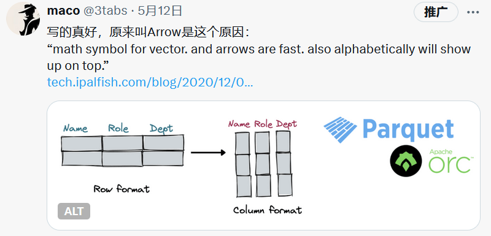

+++
title = "令人沮丧的开源之旅和生活"
description = "As title."
date = 2024-09-20
[taxonomies]
tags= ["OpenSource", "DB", "Moan"]
+++

## 1. 令人沮丧的开源之旅

&#x2003;从 2023.11.14 日开始参与开源项目[GreptimeDB](https://github.com/GreptimeTeam/greptimedb)提交第一个 [PR](https://github.com/GreptimeTeam/greptimedb/pull/2748) 至今天 2024.09.20，我仅仅只提交并合并了屈指可数的 12 个 [PR](https://github.com/GreptimeTeam/greptimedb/pulls?q=is%3Apr+author%3Arealtaobo+is%3Aclosed)，而且大多在我看来都是一些可有可无的提交。尽管所有的 PR 均已经被合并，但除了在看到自己的 PR 被合并的时候会有些微的成就感之外，剩下的还是我麻木的内心。

&#x2003;其实我很清楚之所以有这种失落感是因为我本身参与开源，并不是基于自己的需求来驱动的，尤其是时间序列数据库这个领域和我当前的工作毫无关联，本质上是一种技术投机（从[@tison](https://www.tisonkun.org/)大佬哪儿偷学到的一个词）。而投机的对象是什么哩，毫不避讳的讲就是为了在简历上多一行开源项目的经历，尤其是基础设施领域的开源项目，因为尽管我现在的职位本身是业务开发，但是渴望从事基础设施领域工作的愿望一直还在，还想继续垂死挣扎一下，哈哈哈：）

## 2. 参与开源之我的收获

其实完全可以列个 TODO 让我来更清楚的审视一下自己：

- [ ] 揭开了云时代数据库构建的神秘面纱，尤其在开源组件赋能下的数据库构建竟然可以如此的快速。
- [ ] 对存算分离的架构第一次有了清新而脱俗的认知，也算是理解了为啥 [@Xuanwo](https://xuanwo.io/)大佬要构建[OpenDAL](https://github.com/apache/opendal)。顺带一提，当初之所以没有继续贡献 OpenDAL 就是感觉对自己完全没啥用，lol。
- [ ] 第一次认识和了解到了 Parquet 列式存储，Datafusion，Arrow 等看似高深，实则实现一点也不简单的优秀开源项目，我愿称之为人类开源智慧结晶。
- [ ] 算是勉强搞懂了 WAL，Raft，ETCD 等一些在实现分布式存储时候必须要了解的一些概念，虽然还是一知半解就是了。
- [ ] 最后的最后，我竟然感觉自己的 Rust 语言水平有了些许的进步，竟然感觉自己能写 Rust 项目了，希望不是错觉，哈哈：）

&#x2003;大体上编程方面我暂时能想起来的收获也就是这些了吧，个人的碎碎念莫过如此，随着时间过的越久，我发现还是把这些东西记录下来会比较好，以前总是懒的记录自己不经意间的一个个想法，觉得毫无必要，但现在想想还是蛮有趣的，尤其是在看了自己 [X](https://x.com/3tabs) 上一些历史的帖子之后，如下面这个帖子是我在看到一篇文章后转的，尽管过去这么长时间了，我竟然还记得。

## 3. 枯燥乏味的生活

&#x2003;我怀疑自己是否有抑郁症，但我其实心里很清楚，无非就是想找对象了，这是否能佐证我起码还是个正常人？lol

&#x2003;当然工作上的劳累固然让人觉得暗无天日，但多次面试无法通过更加令人沮丧，我甚至不知道自己是否真的能力不足，还是什么其他的问题。在面试过程中，让人最难受的一个场景无非是：HR 沟通的时候说用人部门通过了简历筛选，但是在真正面试的时候发现面试官完全没了解过你的简历，在面试的过程中也许是发现候选人业务经历不匹配或者说嫌你没相关经验（我猜测），而用一些比较敷衍的问题拖到指定时间就结束了，从此杳无音讯。

&#x2003;当然也有一些面试的体验非常 nice，让我影响最深刻的是某初创公司的一二面面试官，他们竟然会真的有看简历上的 GitHub，这是让人真的感到非常兴奋的一件事，因为诸如上文描述的用人部门面试官未提前了解候选人简历而直接面试的情况实在是太多了。此外，get 了 [@LKI](https://github.com/LKI) 大佬的个人博客 [liriansu.com](https://liriansu.com/)，其中的技术相关文章暂且不表（因为我没看 🐶），但日常的博客，透漏出一种生活的温馨气息，给了我很大的触动。

&#x2003;当然也不都是令人沮丧的事情，让我高兴的是，在生日当天竟然收到了喜欢过的菇凉的消息，要请我喝奶茶，这真是让人感动，她竟然还记得我的生日。但我当时刚好在家，只能遗憾的说下次。

**Hope for a better tomorrow.**
