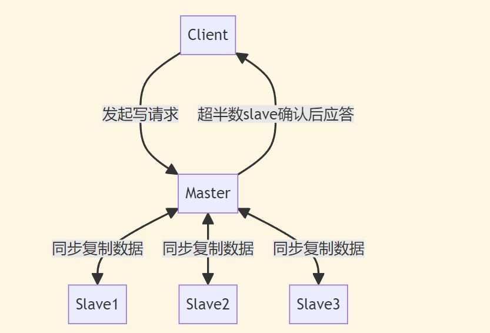

+++
title = "Paxos 和 Raft"
description = "本文主要介绍了本人在学习和了解分布式一致性算法 Paxos 和 Raft 时候的一点浅浅的记录，以及一些学习资料链接。"
date = 2023-03-17
[taxonomies]
tags = ["Distributed", "Raft", "Paxos"]
+++

本质：集群内的多台服务器协同工作，让数据的副本在全部/大多数服务器上保持一致，确保每次读写操作都能得到正确/一致的结果。

> **什么是系统的可靠性要求？**  
> 系统的可靠性要求是指系统在一定时间内能够正常运行的概率。

> **aws 的对象存储可靠性要求是 9~13 个 9，其中 9~13 个 9 的含义是什么？**  
> 9 个 9：99.9999999%的可靠性，即每十亿次操作中，只有一次操作失败。

## 分布式一致性算法

在分布式系统中一份数据冗余的存储多份保证了系统的可靠性, 而多个副本之间的一致, 通常是使用 paxos 这类分布式一致性算法来保证。

## 基础的复制策略

### 主从异步复制


- 优点：主从异步复制的性能很高，因为主节点不需要等待从节点的确认。
- 缺点：主从异步复制的一致性无法保证。因为主节点在写入成功后就会返回确认，而从节点的复制是异步的，在复制的过程中任意一个机器发生故障，都会导致系统的数据出现不一致。

### 主从同步复制


虽然这种复制策略能够保证数据的一致性，但是性能很差，并且因为主节点需要等待所有从节点的确认，那么任何一个从机宕机都会导致整个系统不可用。

### 主从半同步复制


主从半同步复制是主从同步复制和主从异步复制的折中方案。它要求 master 在应答客户端之前必须把数据复制到足够多的机器上,
但不需要是全部。  
但是存在一个显著的问题是，假如 a 数据复制到 slave1，但没有复制到 slave2 和 slave3；数据 b 复制到 slave2 和 slave3，但没有复制到
slave1，那么这个时候如果 master 宕机，就会导致没有一个 slave 是完整的数据，从而导致数据不一致。

### 多数派读写



显然这个策略刚刚好解决了上面主从半同步复制策略的问题，但是这个策略的性能也不好，因为 master 需要等待超过半数的 slave
确认后才能应答客户端。除此之外，在一些情况下，这个策略也无法保证数据的一致性。

如对于一个数据 a 在第一次更新时，在 slave1 和 slave2 上写入了`a=x`；在第二次更新时，在 slave2 和 slave3 上写入了`a=y`
。客户端来访问的时候，会发现 slave1 和 slave2 上的数据是不一致的。

### 多数派读写-后写入优胜

这个策略是对上述策略的一个实现的优化，要求我们在复制数据的时候不仅要写入数据本身，还要写入数据的版本号(保证是递增的即可)
。这样在读取数据的时候，我们可以通过版本号来获取最新的数据，从而保证数据的一致性。

存在的问题：仍旧是上面的例子，假设第二次更新的时候只更新了 slave3，然后客户端直接终止了。那么当客户端再次访问的时候，根据多数派读写的原则，则会发生如下情况：

```
slave1 + slave2 --> a=x
slave2 + slave3 --> a=y
```

显然这就导致了数据的不一致。

**tips:**
大佬的思考逻辑太牛逼了，我自己想的话最多想到主从半同步复制这种折中方案就不再思考了。由此可见，没有一个完美的方案，只有相对完美的方案[doge]。

## Paxos 共识算法

[wikipedia](<https://en.wikipedia.org/wiki/Paxos_(computer_science)>) 是这样介绍 paxos 的：

> Paxos is a family of protocols for solving consensus in a network of unreliable or fallible processors. Consensus is
> the process of agreeing on one result among a group of participants.

它可以被认为是多数派读写的进一步升级, paxos 中通过 2 次原本并不严谨的多数派读写, 实现了严谨的强一致共识算法。

具体推导流程，参看大佬[drmingdrmer](https://github.com/drmingdrmer)
文章[可靠分布式系统-paxos 的直观解释](https://blog.openacid.com/algo/paxos/)。

最终仿照作者[drmingdrmer](https://github.com/drmingdrmer)原版 go 实现的 `paxoskv`，实现了一个 rust
版本的[paxoskv](https://github.com/poltao/consistency/tree/main/paxoskv)，之后我感觉对 `Paxos` 有了一个较为粗浅的认知。

但此时我又开始回想，为什么如今工业界的分布式系统都不再使用 `Paxos` 而是 `Raft`
呢？网上直接搜索看到的答案都是实现过于复杂且难于理解，我觉得要了解真正的原因，只能去看 `Raft` 是如何批判 `Paxos` 的？ `Raft`
又提出了一种怎样的一致性共识策略？raft 在工程上的实现是否真的更简单且易于理解？

## Raft 论文阅读摘要

> 🌻 感谢开源项目 [maemual/raft-zh_cn](https://github.com/maemual/raft-zh_cn)，让我可以以较低的成本阅读 raft 论文。

**总结：leader 选举 + 日志复制 + 应用状态机，这三个部分构成了 Raft 的核心。**
